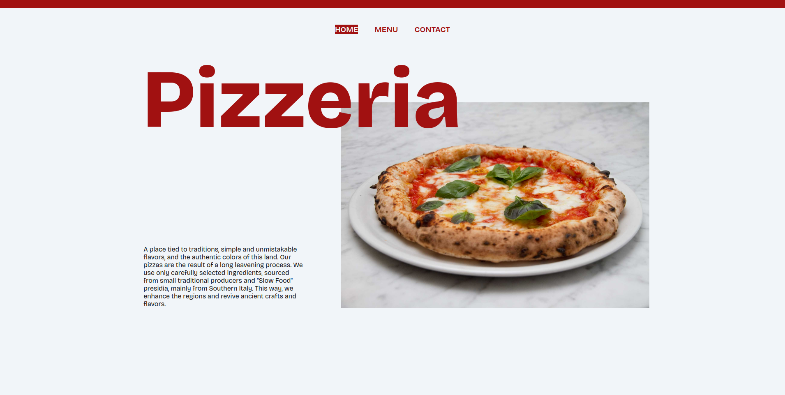

# Restaurant Project


Welcome to the Restaurant Project! This is a multipage website for an imaginary pizzeria named "Pizzeria," built entirely using JavaScript.

The primary objective of this project was to craft a restaurant webpage that features switchable tabs. To achieve this, JavaScript was exclusively employed to generate elements and seamlessly incorporate them into the Document Object Model (DOM). Moreover, a significant emphasis was placed on minimizing the usage of global code by adopting the use of modules.  **Webpack** has been used to budle the modules.

## Project Reflections

- During the course of this project, I gained valuable insights in the following areas:
    - Utilizing Webpack by thoroughly studying its documentation, grasping concepts like module import/export, and effectively managing assets.
    - Proficiently installing packages using npm and adeptly scripting functionalities.
    - Mastering the art of dynamically rendering website content using JavaScript.

- Presented below is a code snippet that I take pride in:

    ```javascript
        const margherita = new Pizza(
            'Margherita',
            'Pomodoro - Mozzarella - Basilico Fresco - Olio EVO',
            '6,50'
        );
        menuContainer.appendChild(margherita.createCard())
    ```
    Where `createCard()` is a method in the `class Pizza`:
    ```javascript
        class Pizza {
        constructor(name, ingredients, price){
            this.name = name;
            this.ingredients = ingredients;
            this.price = price
        }

        createCard() {
            const card = document.createElement('div')
            card.classList = 'card'

            const firstLine = document.createElement('div')
            firstLine.classList = 'first-line'

            const nameTag = document.createElement('h3')
            nameTag.textContent = this.name
            nameTag.classList = 'pizza-name'
            
            const priceTag = document.createElement('p')
            priceTag.textContent = this.price
            priceTag.classList = 'price-tag'

            firstLine.appendChild(nameTag)
            firstLine.appendChild(priceTag)

            const ingredientsTag = document.createElement('p')
            ingredientsTag.textContent = this.ingredients
            ingredientsTag.classList = 'ingredients-tag'

            card.appendChild(firstLine)
            card.appendChild(ingredientsTag)
            
            return card
        }
    }
    ```
    Although I could have written an additional method to prevent code repetition within the `createCard` method, I acknowledge that just a few weeks ago, I would have been far from arriving at this solution.

## Future Upgrades

- Responsive design
- Footer


